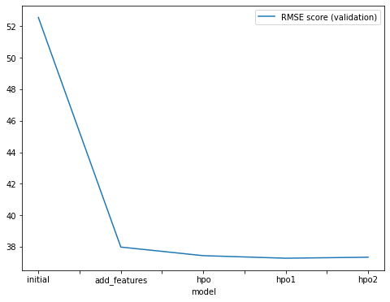
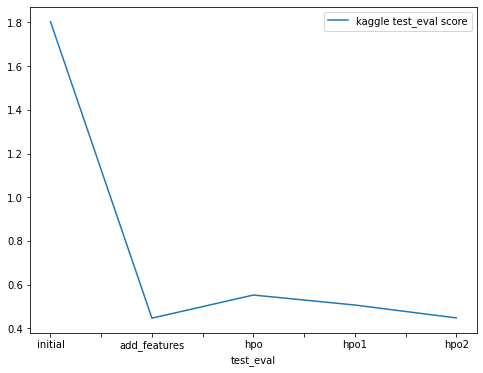

# Report: Predict Bike Sharing Demand with AutoGluon Solution
#### Rohan R Mahishi

## Initial Training
### What did you realize when you tried to submit your predictions? What changes were needed to the output of the predictor to submit your results?
The following five experiments were conducted:

Initial Raw Submission [Model: initial]
Added Features Submission (EDA + Feature Engineering) [Model: add_features]
Hyperparameter Optimization (HPO) - Initial Setting Submission
Hyperparameter Optimization (HPO) - Setting 1 Submission
Hyperparameter Optimization (HPO) - Setting 2 Submission [Model: hpo (top-hpo-model: hpo2)]
Observation: It was found that some predictions produced negative prediction values. However, Kaggle does not accept submissions with negative predictions. Therefore, all negative outputs from the respective predictors were replaced with 0.

### What was the top ranked model that performed?
The highest-ranked model in this experiment was the "add features" model called WeightedEnsemble_L3. It achieved a validation RMSE score of 37.9800 and the best Kaggle score of 0.44798 on the test dataset. This model was developed by training on data that underwent exploratory data analysis (EDA) and feature engineering, without using hyperparameter optimization.

Although some models showed improved RMSE scores on the validation data after hyperparameter optimization, the "add features" model performed the best on the unseen test dataset. It's important to note that many models delivered competitive performance, so the selection process took into account both the RMSE scores from cross-validation and the Kaggle scores from the test data.

Please note that in the jupyter notebook, the autogluon package considers RMSE scores to be negative in order to rank them highest. To obtain accurate RMSE scores, these negative values need to be multiplied by -1. Therefore, the values may appear as negative RMSE values in the notebook.

## Exploratory data analysis and feature creation
### What did the exploratory analysis find and how did you add additional features?
The datetime feature was parsed to extract the hour information.
The categorical features "season" and "weather" were transformed into the category data type.
Independent features such as year, month, day (dayofweek), and hour were extracted from the datetime feature using feature extraction, and the datetime feature itself was dropped.
The features "casual" and "registered" showed significant improvement in RMSE scores during cross-validation but were absent in the test data, so they were dropped.
A new categorical feature called "day_type" was created based on the "holiday" and "workingday" features to categorize weekdays, weekends, and holidays effectively.
The features "temp" and "atemp" had a high positive correlation (0.98), so "atemp" was removed from both the train and test datasets to reduce multicollinearity.
Data visualization was performed to gain insights from the features.

### How much better did your model preform after adding additional features and why do you think that is?
The inclusion of additional features led to a significant improvement of approximately 138% in model performance compared to the initial/raw model that did not involve exploratory data analysis (EDA) or feature engineering.

The performance of the model was enhanced by converting certain categorical variables with integer data types into their appropriate categorical data types.

To reduce multicollinearity, the "atemp" variable, which had a high correlation with the "temp" variable, was dropped from the datasets. Similarly, the "casual" and "registered" features, present only in the train dataset, were ignored during model training.

Splitting the datetime feature into separate features such as year, month, day, and hour, along with the addition of the "day_type" feature, further improved the model's performance. These independent variables enabled the model to effectively capture seasonality and historical patterns in the data.

Overall, these steps resulted in enhanced model performance and a more robust representation of the data.

## Hyper parameter tuning
### How much better did your model preform after trying different hyper parameters?
Hyperparameter tuning proved to be beneficial as it improved the model's performance compared to the initial submission. Three different configurations were used for hyperparameter optimization experiments. Although the hyperparameter-tuned models performed competitively with the model that included EDA and added features, the latter performed significantly better on the Kaggle test dataset.

Observations:

Consideration was given to the prescribed settings when using the autogluon package for training. However, the performance of the hyperparameter-optimized models was suboptimal due to the fixed set of hyperparameter values provided by the user, which limited the exploration options for autogluon.

The 'time_limit' and 'presets' parameters played a crucial role in hyperparameter optimization using autogluon. Insufficient time limit could result in autogluon failing to build any models for the specified hyperparameters. Moreover, using presets like "high_quality" with auto_stack enabled required high memory usage and were computationally intensive within the given time limit and available resources. As a result, lighter and faster presets such as 'medium_quality' and 'optimized_for_deployment' were experimented with. Ultimately, the "optimized_for_deployment" preset, which was faster and lighter, was chosen for the hyperparameter optimization routine as other presets failed to create models using AutoGluon for the experimental configurations.

Balancing exploration and exploitation proved to be the major challenge when using AutoGluon with a specified range of hyperparameters.

### If you were given more time with this dataset, where do you think you would spend more time?
Given additional time, I would explore further possibilities by running AutoGluon for an extended period with a high-quality preset and improved hyperparameter tuning. This would allow for a more thorough investigation of potential outcomes and potentially yield better results.

### Create a table with the models you ran, the hyperparameters modified, and the kaggle score.
|model|hpo1|hpo2|hpo3|score|
|--|--|--|--|--|
|initial|prescribed_values|prescribed_values|"presets: 'high quality' (auto_stack=True)"|1.84484|
|add_features|prescribed_values|prescribed_values|"presets: 'high quality' (auto_stack=True)"|0.50695|
|hpo (top-hpo-model: hpo2)|Tree-Based Models: (GBM, XT, XGB & RF)|KNN|"presets: 'optimize_for_deployment"|0.44798|

### Create a line plot showing the top model score for the three (or more) training runs during the project.

### Create a line plot showing the top kaggle score for the three (or more) prediction submissions during the project.

## Summary
The bike sharing demand prediction project extensively utilized the AutoGluon AutoML framework for Tabular Data. AutoGluon was employed to create stack ensembles and individual regression models trained on tabular data, providing a quick baseline model.

The top-performing model, built using AutoGluon, significantly improved results by incorporating data from thorough exploratory data analysis (EDA) and feature engineering, without hyperparameter optimization. AutoGluon's automatic hyperparameter tuning, model selection/ensembling, and architecture search capabilities were leveraged to explore and exploit the best options.

Although hyperparameter tuning with AutoGluon showed improved performance compared to the initial raw submission, it did not surpass the model developed with EDA, feature engineering, and no hyperparameter tuning.

It was observed that hyperparameter tuning using AutoGluon, without default hyperparameters or random parameter configurations, can be a complex process. It heavily relies on factors such as the time limit, prescribed presets, model families, and the range of hyperparameters to be tuned.
